# Plugin QGIS OpenComptage

## Barre d'outils
Le plugin, une fois installé, ajoute à l'interface QGIS une barre d'outils
composée de plusieurs boutons qui permettent d'effectuer différentes
opérations.
<figure>
  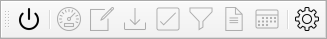
  <figcaption>Barre d'outils du plugin au démarrage</figcaption>
</figure>

Les outils sont, dans l'ordre :

- Connection DB
- Création d'un comptage
- Modification d'un comptage
- Importation de données
- Validation de données
- Filtrage
- Rapport annuel
- Importation fichiers ICS
- Réglages

Au démarrage, seuls les outils `Connection DB` et `Réglages` sont actifs.

### Connection DB
Le bouton  
`Connection DB` ouvre une connexion à la base de données et charge les couches 
de l'application dans QGIS, en fonction de ce qui a été défini dans les 
réglages.
<figure>
  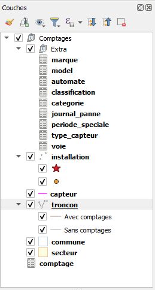
  <figcaption>Couches dans QGIS avec l'option "Extra" activée</figcaption>
</figure>

Cela active aussi les boutons intermédiaires de la barre d'outil
<figure>
  
  <figcaption>Barre d'outils du plugin après connection</figcaption>
</figure>

### Création d'un comptage
Pour créer un nouveau comptage (élément dans la couche `comptage`), l'outil 
`Créer un nouveau comptage` permet de simplifier les opérations par rapport à 
l'insertion manuelle dans la table.

Pour pouvoir utiliser cet outil, il faut commencer par sélectionner un tronçon
 sur la carte en utilisant les outils de sélection de géométrie QGIS standards. 
 Pour simplifier la recherche du tronçon à sélectionner, vous pouvez utiliser 
 l'outil de recherche dans la couche `tronçon`.

Une fois que vous avez sélectionné le tronçon pour lequel vous voulez créer
un nouveau comptage, le bouton  
`Créer un nouveau comptage` permet 
d'afficher le formulaire de saisie des données du comptage. Avant de pouvoir 
utiliser ce nouveau comptage, il est nécessaire de le sauvegarder dans la base 
de données.
<figure>
  
  <figcaption>Création d'un nouveau comptage</figcaption>
</figure>

### Modification d'un comptage
Après avoir sélectionné un tronçon sur la carte, le 
bouton 
`Modifier comptage` permet d'afficher la table d'attributs de la couche 
`comptage` filtrée sur les comptages du tronçon sélectionné. 
Vous pouvez alors éditer les données ou lancer une action.
<figure>
  
  <figcaption>Modification d'un comptage</figcaption>
</figure>

### Importation de données
Vous pouvez importer des données de deux manières différentes. Soit en 
spécifiant directement à quel comptage ces données appartiennent, soit en 
laissant le programme déterminer à quel comptage ils appartiennent sur la base 
de la date et du tronçon sur lequel le comptage est effectué. 

Pour importer un seul fichier et associer les données qu'il contient à un 
comptage, utilisez l'action `Importer` de la table attributaire de la couche 
`comptage` et sélectionnez ensuite le fichier à importer.
<figure>
  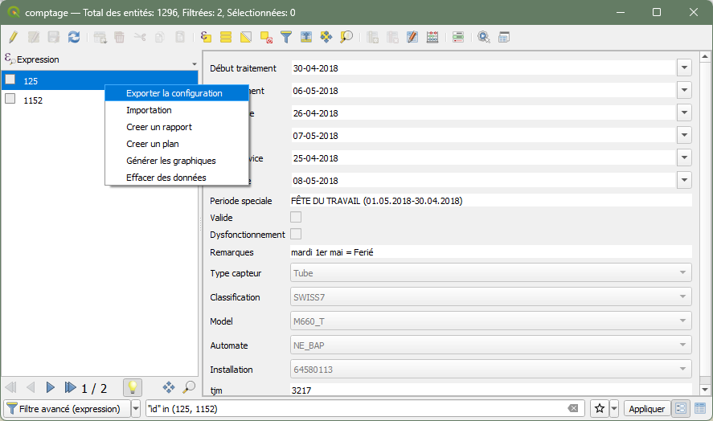
  <figcaption>Actions comptage</figcaption>
</figure>

Pour importer un ou plusieurs fichiers et laisser le système identifier à quel 
comptage chacun d'eux appartiennent, utilisez le 
bouton 
`Importation` de la barre d'outils.

Une fois que les données ont été importées, une fenêtre apparaît qui présente 
graphiquement les données importées (graphiques par heure et voie, par 
catégorie et par vitesse), de sorte que vous pouvez évaluer d'un coup d'œil si 
les données semblent correctes et décider de les importer définitivement dans 
la base de données ou de les écarter.
<figure>
  
  <figcaption>Validation des données</figcaption>
</figure>

### Validation de données
La fenêtre de validation des données peut être appelée à l'aide du 
bouton  
`Validation`. Elle montre toutes les données qui ont été importées mais pas 
encore validées, dans autant d'onglets qu'il y a de tronçons concernés.

### Filtrage
Le bouton  
`Filtrer` de la barre d'outils permet de filtrer les `tronçons` qui 
sont affichés sur la carte (couche "troncon"). 

Vous pouvez filtrer par date de début, date de fin, type d'installation 
(permanente ou périodique), type de capteur (tube, boucle,...), TJM, axe et 
secteur.
<figure>
  
  <figcaption>Options de filtrage</figcaption>
</figure>

### Rapport annuel
Le bouton 
`Rapport annuel` permet de générer un rapport annuel d'un tronçon.
Vous pouvez choisir la classification et l'année pour le tronçon sélectionné.
Si le tronçon sélectionné fait partie d'un cas spécial, un rapport est généré 
pour chacun des tronçons de ce cas spécial.
Pour qu'un rapport annuel puisse être généré, il faut que le comptage concerné 
contienne au moins 100 jours de données.
<figure>
  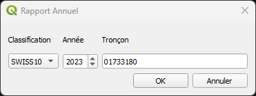
  <figcaption>Options rapport annuel</figcaption>
</figure>

### Importation fichiers ICS
Le bouton 
`Importer fichier ICS` permet de charger un fichier calendrier au format ICS 
dans la base de données. Les événements seront considérés comme des périodes 
spéciales (vacances et jours fériés) à prendre en compte dans les rapports 
hebdomadaires.

### Réglages
Le bouton 
`Réglages` de la barre d'outils permet de spécifier les options du 
programme. Ces options, stockées dans le profil QGIS en cours, sont à définir 
avant de pouvoir accéder aux autres fonctions.

Ces options concernent:
- les données de connexion avec la base de données 
- l'affichage du bloc de couches supplémentaires "Extra"
- les répertoires par défaut où rechercher et sauvegarder les fichiers
<figure>
  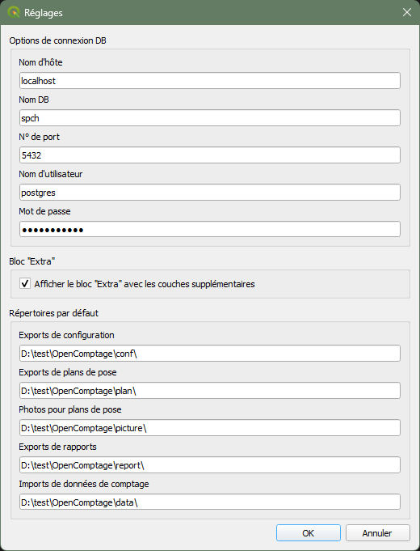
  <figcaption>Réglages</figcaption>
</figure>

## Actions comptage
Dans la table attributaire de la couche `comptage`, vous pouvez effectuer des 
actions sur les comptages présents. 
Pour afficher le menu des actions dans la vue formulaire, il faut cliquer droit 
sur un comptage.
<figure>
  
  <figcaption>Actions comptage dans la vue formulaire</figcaption>
</figure>

Dans la vue tabulaire, les actions sont présentées dans un menu déroulant dans 
la dernière colonne.
<figure>
  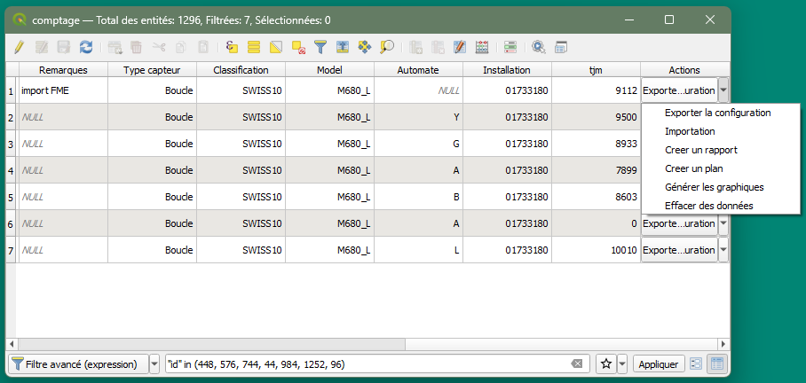
  <figcaption>Actions comptage dans la vue tabulaire</figcaption>
</figure>

Les actions disponibles sont, dans l'ordre :

- Générer le fichier de configuration
- Importer un fichier de données
- Générer le plan de pose
- Afficher les graphiques
- Générer les rapports hebdomadaires
- Effacer des données

### Générer le fichier de configuration
L'action `Générer le fichier de configuration` crée un fichier .CMD dépendant du modèle
de dispositif défini pour le comptage. Par défaut, le nom de fichier est "<installation\>.cmd".
Pour les appareils le supportant, cela permet d'automatiser leur configuration.

Vous pouvez ajouter une partie de configuration fixe pour un modèle spécifique 
dans le champ `configuration` de la couche `modèle`.
<figure>
  
  <figcaption>Configuration fixe</figcaption>
</figure>

### Importer un fichier de données
L'action `Importer un fichier de données` permet de sélectionner un seul fichier et d'associer les 
données qu'il contient au comptage. Une fois l'importation terminée, la fenêtre 
de validation de ces données s'ouvre.
<figure>
  
  <figcaption>Importation de données de comptage</figcaption>
</figure>

### Générer le plan de pose
L'action `Générer le plan de pose` permet la génération d'un plan de pose au 
format PDF. Le nom de fichier par défaut est "plan_de_pose_<installation\>.pdf"

### Afficher les graphiques
L'action `Afficher les graphiques` permet la visualisation des graphiques du comptage. 
Ces graphiques sont identiques à ceux montrés lors de l'importation des données.
<figure>
  
  <figcaption>Graphiques d'un comptage</figcaption>
</figure>

### Générer les rapports hebdomadaires
L'action `Générer les rapports hebdomadaires` permet la génération d'un ou plusieurs rapport(s) 
hebdomadaire(s) au format XLSX.
Si le comptage sélectionné concerne un cas spécial, tous les tronçons de ce 
cas spécial sont proposés dans le formuaire du rapport.
Le nom de fichier est défini ainsi: "<tronçon\>_<AAAAMMJJ\>_r.xlsx"
<figure>
  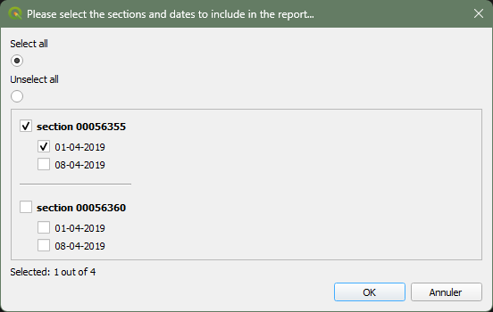
  <figcaption>Générer les rapports hebdomadaires</figcaption>
</figure>

### Effacer des données
L'action `Effacer des données` permet de supprimer des données en fonction 
d'une plage de dates et permet aussi de choisir des données `validées` et/ou 
`à valider`.
<figure>
  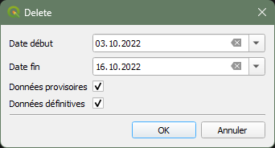
  <figcaption>Effacer des données d'un comptage</figcaption>
</figure>


## Utilisation avancée
### Ajouter un nouvel automate
<figure>
  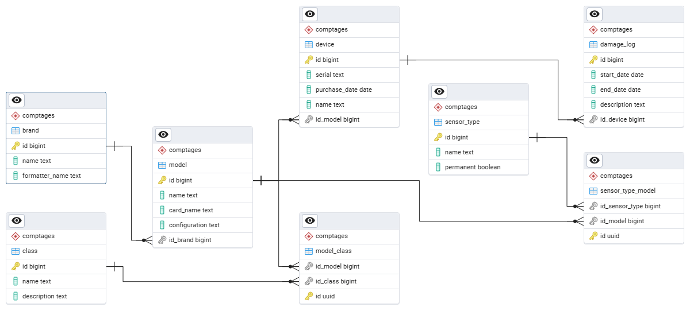
  <figcaption>Relations pour la gestion des automates</figcaption>
</figure>

La table `device` (chargée dans la couche `automate` de QGIS), contient la 
liste des dispositifs disponibles. Chaque dispositif doit avoir une référence à 
un modèle (défini dans la table `model`) et chaque modèle doit avoir une 
référence à une marque (définie dans la table `brand`).
Pour ajouter un nouveau dispositif, il suffit d'ajouter dans QGIS un élément à 
la table attributaire de la couche `automate` (et éventuellement aux tables 
`model` et `brand`).
Un automate correspond donc à un compteur de trafic placé dans le terrain. 

En cas de besoin, il est possible d'associer un dommage à chaque `automate`.

Pour un nouveau modèle d'`automate`, il faut aussi compléter les tables 
`model_class` et `sensor_type_model` afin que les listes déroulantes de QGIS 
montrent ces nouveautés. Ces opérations doivent se faire directement 
dans la base de donnée.


### Ajouter un nouveau type de capteur
<figure>
  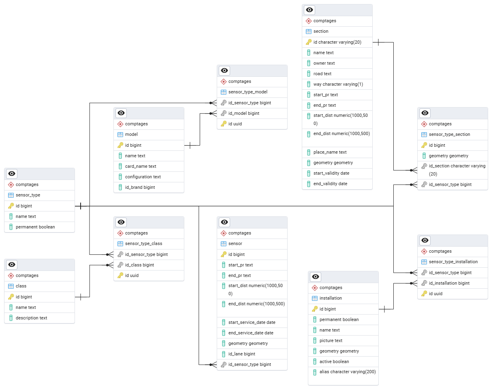
  <figcaption>Relations pour la gestion des capteurs</figcaption>
</figure>

Pour ajouter un nouveau type de capteur, il ne suffit pas d'ajouter dans QGIS 
un élément à la table attributaire de la couche `type_capteur`. Il faut aussi 
compléter les tables `sensor_type_class` et `sensor_type_model` afin que les 
listes déroulantes de QGIS montrent ces nouveautés. Ces opérations doivent se 
faire directement dans la base de donnée.

### Ajouter une nouvelle classe
<figure>
  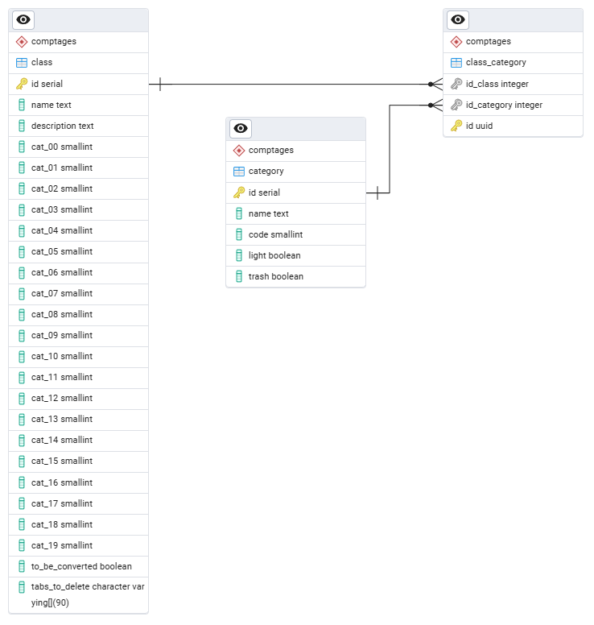
  <figcaption>Relation entre classes et catégories</figcaption>
</figure>

Pour ajouter une nouvelle classe, il faut ajouter un élément dans la table 
`class` et des éléments dans la table `category`, puis il faut les relier dans 
la table `class_category`. Ces opérations doivent se faire directement dans la 
base de donnée.

### Modification de la circulation
Chaque `tronçon` (nom de la table `section` dans QGIS) est composé d'une ou 
plusieurs voies de circulation. A chaque `voie` (nom de la table `lane` dans 
QGIS) est attribuée une `direction` qui doit correspondre au sens de 
circulation réel (dans le terrain). Par définition, lorsque la circulation 
s'écoule dans le sens de l'axe, `direction` prend la valeur 1. Dans le cas 
contraire, `direction` prend la valeur 2.

En cas de modification de la circulation sur un `tronçon`, par exemple si il
passe de 4 à 3 voies, il suffit de supprimer la `voie` devenue inutile.

### Cas spéciaux
Les `cas speciaux` sont des installations où plusieurs voies de sections 
différentes sont mesurées à partir de la même installation. Chaque voie a une 
relation (foreign key) avec une installation. En attribuant plusieurs voies à 
la même installation, il est possible de créer des cas speciaux. 
Ces tables ne sont normalement pas chargées comme des couches dans QGIS, donc 
normalement ces changements sont faits directement dans la base de données.

Dans l'exemple suivant, l'installation `53309999` est composée de 8 voies sur 
6 tronçons différents. Les tronçons sont: `00056200`, `00056202`, `53316875`, 
`53326880`, `53336885` et `53346890`.
Dans la base de données, les 8 voies ont une relation (foreign key dans le champ 
id_installation) avec la même installation.
Si nous regardons les données de ce cas spécial dans la base de données, nous 
verrons quelque chose comme ceci :

``` postgres
select l.id, l.number, l.direction, l.direction_desc, l.id_section, 
l.id_installation, i.name as i_name from lane as l
join installation as i on l.id_installation = i.id
where i.name = '53309999'
```
| id    | number | direction | direction_desc               | id_section | id_installation | i_name   |
|-------|--------|-----------|------------------------------|------------|-----------------|----------|
| 17514 | 1      | 1         | Neuchâtel - Bevaix           | 00056200   | 8768            | 53309999 |
| 17515 | 2      | 2         | Frontièrevaudoise(Vaumarcus) | 00056200   | 8768            | 53309999 |
| 17516 | 3      | 1         | (Bevaix)Treytel              | 00056202   | 8768            | 53309999 |
| 17517 | 4      | 2         | (Bevaix)Treytel              | 00056202   | 8768            | 53309999 |
| 17518 | 5      | 1         | Bevaix                       | 53316875   | 8768            | 53309999 |
| 17519 | 6      | 1         | Neuchâtel                    | 53326880   | 8768            | 53309999 |
| 17520 | 7      | 1         | Bevaix                       | 53336885   | 8768            | 53309999 |
| 17521 | 8      | 1         | Yverdon                      | 53346890   | 8768            | 53309999 |

Il faut faire correspondre l'ordre des voies (`number`) au câblage des capteurs 
et leur sens (`direction`) à ce qui figure dans le terrain.

Si il devient nécessaire de modifier un cas spécial, il faut attribuer d'autres 
`id_installation` aux voies à retirer du cas spécial, si celles-ci sont 
conservées dans le terrain. Si elles ne sont pas conservées, supprimer ces 
voies.
